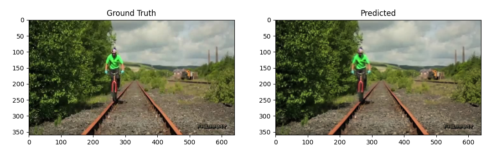

# AdaConv-Pytorch

This is a reference implementation of Video Frame Interpolation via Adaptive Separable Convolution [1] using PyTorch. Given two frames, it will make use of [adaptive convolution](http://graphics.cs.pdx.edu/project/adaconv) [2] in a separable manner to interpolate the intermediate frame. Should you be making use of the work, please cite the paper [1].

This is a modified version of [original code](https://github.com/HyeongminLEE/pytorch-sepconv), implemented by [Hyeongmin Lee](https://github.com/HyeongminLEE).

## setup
The separable convolution layer is implemented in CUDA using CuPy, which is why CuPy is a required dependency. It can be installed using `pip install cupy` or alternatively using one of the provided binary packages as outlined in the CuPy repository.

## To Prepare Training Dataset
We have modified his code for suiting the [Visual Tracker Benchmark](http://cvlab.hanyang.ac.kr/tracker_benchmark/datasets.html) dataset in `download_dataset.py`. The urls for the classes have been included in the beginning of this file. We have tried it for 5 classes, viz, 'Basketball', 'Biker', 'Freeman4', 'BlurCar2' and 'Bird1'. 

Run `python download_dataset.py` to download these datasets into the `db`(default) folder. You can add new classes by copying the download links for other classes and placing in the 'urls' list inside `download_dataset.py`


## Train
```
python train.py --epochs=10 --train ./your/datset/dir --out_dir ./output/folder/tobe/created
```

## Test
```
python test.py --input ./test/input/VTB/data
```


## demo interpolation



## license
The provided implementation is strictly for academic purposes only. Should you be interested in using the technology for any commercial use, please feel free to contact [Hyeongmin Lee](https://github.com/HyeongminLEE).


## references
```
[1]  @inproceedings{Niklaus_ICCV_2017,
         author = {Simon Niklaus and Long Mai and Feng Liu},
         title = {Video Frame Interpolation via Adaptive Separable Convolution},
         booktitle = {IEEE International Conference on Computer Vision},
         year = {2017}
     }
```

```
[2]  @inproceedings{Niklaus_CVPR_2017,
         author = {Simon Niklaus and Long Mai and Feng Liu},
         title = {Video Frame Interpolation via Adaptive Convolution},
         booktitle = {IEEE Conference on Computer Vision and Pattern Recognition},
         year = {2017}
     }
```


